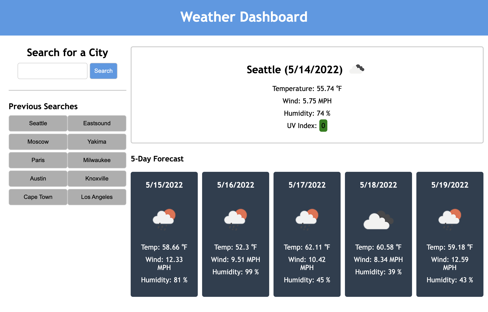

# UWCB-06-Homework
UW Coding Bootcamp : Homework 06

## Description

An app to check the weather - current day and 5 days out - for any city in the world. Type in a new city to search or choose from a list of archived cities (logged by your browser). The app displays temp, wind speed, humidity, and UV Index for the current day ... and everything but UV for the 5 Day Forecast.
## Page Link
<a href="https://pdubya1632.github.io/UWCB-06-Homework/index.html">https://pdubya1632.github.io/UWCB-06-Homework/index.html</a>
## Preview

